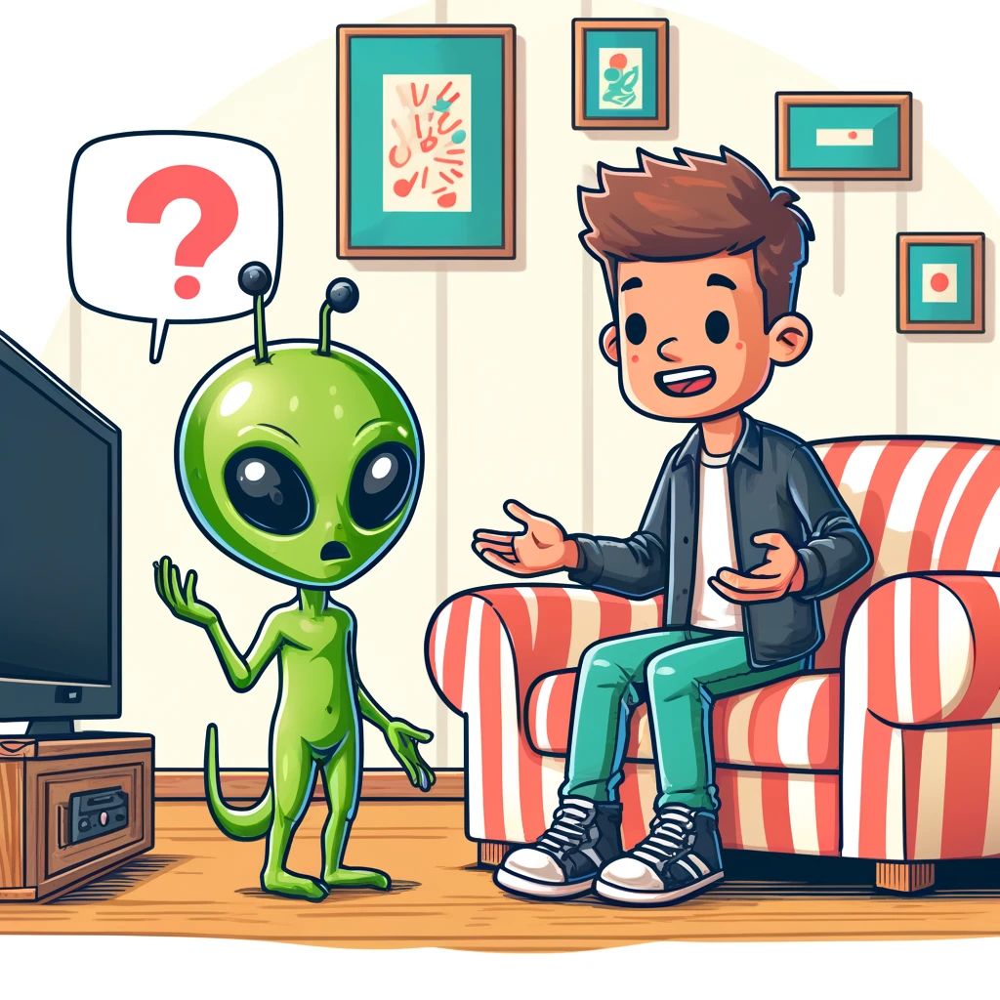

# Classification-of-Dialogue-Segment-Breaks---CSE582
This is the repository of Group 4 for CSE582 Final Project.

## Overview Of The Task
To understand the complex structure of how situated dialogues evolve, we utilize the first increment of a new dataset, called GUIDE: Growing Understanding through Interactive Daily Experience, and the RoBERTa pre-trained classification model to learn a function from sequential pairs of utterances to output labels that represent segment breaks in dialogue. Compared to baseline models (LLama2 and SVM), we find that our model outperforms various metrics on both labels. We also utilize several ablation studies to investigate the effect of tokenizers, intent labels, and augmented datasets.

## Data Preprocessing
(Valerie) update 4/10: added a label_1.csv file to the dataset repo below. It contains all label 1 dialogues (N=1056), sourced from TRAINS93 and QuartoDial.

### Folder to upload Preprocessed Datasets - [Click Here](https://pennstateoffice365-my.sharepoint.com/:f:/g/personal/hmp5565_psu_edu/EuAqhN2dA5ZAg3xCPeRZwNsB4pZquDW6onc20c9BGTo-XQ?e=hYBv6N)

### Variable Descriptions: 
- **category_name**: The name of the activity.

| category_name      | Frequency | Percentage |
|--------------------|-----------|------------|
| using_microwave    | 768       | 15.06%     |
| wash_glass         | 655       | 12.84%     |
| using_oven         | 649       | 12.73%     |
| using_computer     | 640       | 12.55%     |
| bedroom_cabinet    | 626       | 12.27%     |
| watch_tv           | 621       | 12.18%     |
| using_stove        | 606       | 11.88%     |
| read_book          | 535       | 10.49%     |

- **category_number**: The activity variants, or confusion types. Each activity type has four variant videos, indexed from 0 to 3, where 0 is a variant where the alien is able to complete the task with no confusion; 1 represents a confusion that causes the alien to freeze for a moment due to cognitive overload; 2 represents the alien using the wrong object; 3 represents a wrong location.

| category_number | Frequency | Percentage |
|-----------------|-----------|------------|
| 0               | 1226      | 24.04%     |
| 1               | 1188      | 23.29%     |
| 2               | 1472      | 28.86%     |
| 3               | 1214      | 23.80%     |

- **change_speaker**: Whether or not the two utterances happen between two different users/speakers. 1 indicates two different speakers, and 0 indicates the same speaker.

| change_speaker | Frequency | Percentage |
|----------------|-----------|------------|
| 0              | 1091      | 21.39%     |
| 1              | 4009      | 78.61%     |

- **utterance1_intent**: The intent label for utterance 1.
- **utterance2_intent**: The intent label for utterance 2.

## Models used in this project

### Baseline Models
- **Llama2**: LLaMA 2 is a collection of pre-trained and fine-tuned large language models. We chose Llama2-13b-chat-hf for the balance of its superior performance on a set of linguistic tasks and its parameter scale.  We included three columns of data: user, utterance, and intent. Our best result from this model comes from a 2-shot learning design, where 2 examples are provided as a part of context. 

- **SVM**: SVM classifies data by finding an optimal line or hyperplane that maximizes the distance between each class in an N-dimensional space. We adjust the class weights to handle the imbalance of the data. The best results from this model come from a specific choice of inputs - utterance1, utterance2_text, and category. 

### Superior Model
- **RoBERTa**: RoBERTa is a variant of BERT (Bidirectional Encoder Representations from Transformers) that improves its training process. It is pre-trained on a larger corpus with longer sequences and more training steps compared to BERT, resulting in better performance on downstream tasks. We trained the RoBERTa model on the tokenized utterance pairs using the AdamW optimizer (as this is the industry standard).

### Results

### Additional Experiments
* As an attempt to preprocess the dataset, we tried to use approaches like UnderSampling and SMOTE on the dataset and then trained the model with the new dataset. However, the results were bad.
* We fine-tuned the GEMMA 5 model on the tokenized utterance pairs using the Unsloth framework. GEMMA models are well-suited for various text generation tasks due to their architecture, which incorporates both text and multimodal inputs. They have demonstrated effectiveness in tasks like question answering, summarization, and reasoning. Unsloth provides a quantized version of the GEMMA model, making it feasible to fine-tune on limited compute resources such as a single T4 GPU.
  
